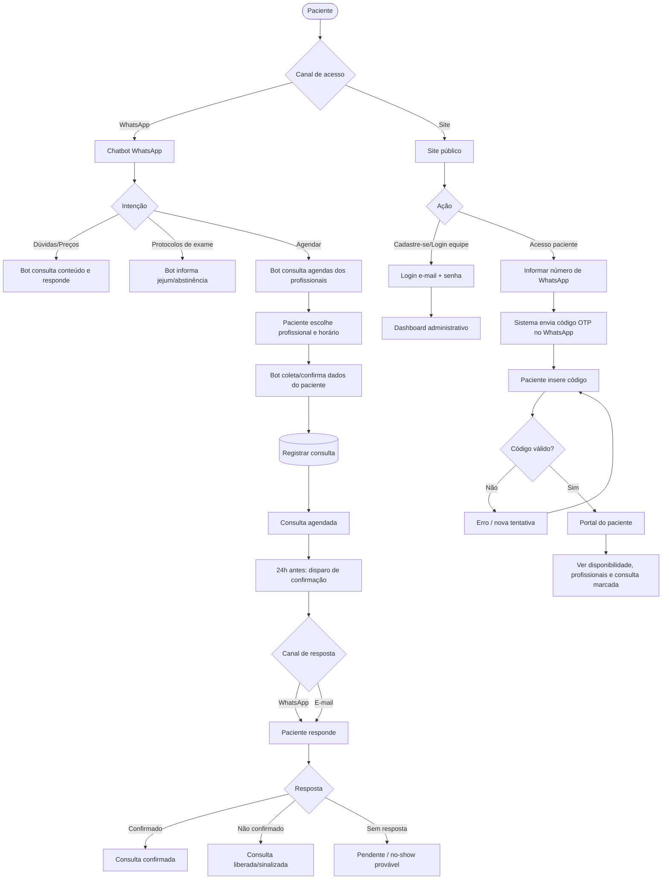
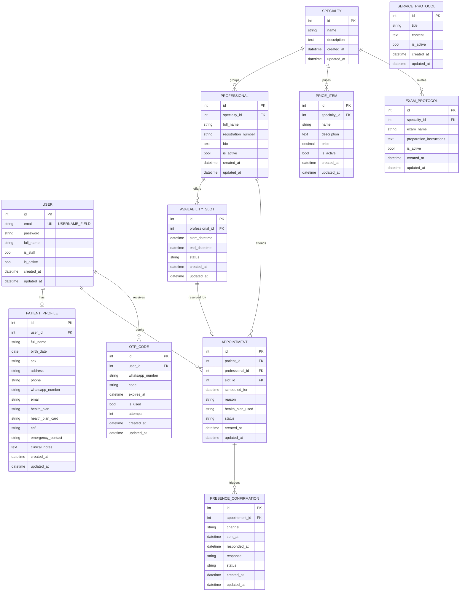

# PRD — Sistema de Agendamento para Clínica Médica

> Documento de Requisitos de Produto (Product Requirement Document)
> Versão 1.0 · Status: Baseline para desenvolvimento

---

## 1. Visão geral

Sistema web de agendamento para clínica médica com múltiplos profissionais, no qual o **canal primário de atendimento é o WhatsApp** (via chatbot) e o **site é um complemento de consulta e autoatendimento**.

O chatbot do WhatsApp consulta a base de dados e as agendas dos profissionais, interage com o paciente, responde dúvidas e informa preços, protocolos de atendimento e protocolos de exames. Todo esse conteúdo informativo é **cadastrado posteriormente pela equipe da clínica**; o sistema fornece apenas a estrutura para armazená-lo e exibi-lo.

O site oferece apresentação institucional, cadastro, login e um dashboard. Pacientes podem, ainda, acessar a plataforma por **código de uso único (OTP)** enviado ao número de WhatsApp cadastrado, para verificar disponibilidade de agenda, profissionais e a consulta marcada.

A solução é construída em **Django full-stack**, com frontend em **Django Template Language (DTL)** estilizado com **TailwindCSS**, persistência em **SQLite**, autenticação **nativa do Django por e-mail** e arquitetura modular separada em **apps Django por domínio**. O escopo é deliberadamente **enxuto**: nada além do solicitado é implementado.

### Interpretação de escopo adotada (decisão explícita)

Para resolver a coexistência entre "Cadastre-se / Login por e-mail" e o "acesso por OTP no WhatsApp", o PRD adota a interpretação **mais enxuta e coerente**:

- **Equipe da clínica e profissionais** autenticam por **e-mail + senha** (sistema nativo do Django) e acessam o **dashboard administrativo** para gestão de agendas, conteúdo informativo e consultas.
- **Pacientes** acessam o **portal do paciente** de forma **passwordless via OTP no WhatsApp** (Requisito 1), para conferir disponibilidade e suas consultas. O cadastro do paciente é majoritariamente originado pelo fluxo do chatbot; o portal apenas o consulta.

Essa separação mantém um único sistema de usuários (Django nativo, login por e-mail), reservando o OTP como mecanismo de verificação passwordless do paciente.

---

## 2. Sobre o produto

| Item | Descrição |
|---|---|
| **Nome (provisório)** | Agenda Clínica |
| **Tipo** | Aplicação web full-stack (Django) + integração com chatbot de WhatsApp |
| **Canal primário** | WhatsApp (chatbot) |
| **Canal complementar** | Site web responsivo |
| **Perfis** | Paciente, Recepção/Equipe da clínica, Profissional, Administrador |
| **Domínios** | Contas/Autenticação, Profissionais, Agendamento, Conteúdo da clínica, Mensageria (WhatsApp/OTP/Confirmação) |
| **Persistência** | SQLite padrão do Django |
| **Idioma da interface** | Português brasileiro |
| **Idioma do código** | Inglês |

O produto cobre três frentes funcionais centrais:

1. **Atendimento conversacional** — chatbot no WhatsApp consulta dados e agendas, responde dúvidas e exibe preços e protocolos.
2. **Autoatendimento web** — verificação de agenda/profissionais e consulta do próprio agendamento, com acesso por OTP.
3. **Confirmação de presença** — disparo de confirmação 24h antes da consulta, respondida via WhatsApp e/ou e-mail.

---

## 3. Propósito

Reduzir o atrito do agendamento e da informação ao paciente, centralizando no WhatsApp (canal de maior adesão no Brasil) a marcação, a consulta de preços/protocolos e a confirmação de presença, ao mesmo tempo em que se oferece um canal web confiável para autoconsulta. Para a clínica, o propósito é **diminuir faltas (no-show)**, **padronizar a informação prestada** e **organizar as agendas de múltiplos profissionais** numa fonte única de verdade.

---

## 4. Público-alvo

- **Pacientes** — pessoas que buscam marcar consultas e tirar dúvidas; perfil heterogêneo de idade e familiaridade digital, com forte preferência pelo WhatsApp.
- **Recepção / Equipe da clínica** — operam o sistema, cadastram conteúdo informativo (preços, protocolos), gerenciam agendas e acompanham confirmações.
- **Profissionais de saúde** — têm suas agendas e disponibilidades refletidas no sistema.
- **Administrador da clínica** — configura o sistema, gerencia usuários da equipe e parametriza o catálogo de serviços.

---

## 5. Objetivos

| # | Objetivo | Como o produto o atende |
|---|---|---|
| O1 | Permitir agendamento conversacional pelo WhatsApp | Chatbot integrado consulta agendas e registra consultas |
| O2 | Disponibilizar informação padronizada (preços e protocolos) | Estrutura de conteúdo cadastrável pela equipe e consultável pelo bot e pelo site |
| O3 | Oferecer autoatendimento web seguro e simples | Acesso por OTP no WhatsApp + portal de consulta |
| O4 | Reduzir faltas | Confirmação de presença automática com 24h de antecedência |
| O5 | Organizar agendas de múltiplos profissionais | Modelo de disponibilidade e consultas centralizado |
| O6 | Manter o sistema simples e sustentável | Arquitetura enxuta em Django nativo, apps isoladas, sem dependências supérfluas |

---

## 6. Requisitos funcionais

### RF — Autenticação e acesso
- **RF01** — A equipe e os profissionais autenticam por **e-mail + senha** (sistema nativo do Django).
- **RF02** — O paciente acessa o portal de forma passwordless: informa o **número de WhatsApp cadastrado**, recebe um **código OTP** nesse número e o insere para concluir o acesso.
- **RF03** — O OTP é de **uso único**, com **expiração** e **limite de tentativas**.
- **RF04** — Após autenticação, o usuário é direcionado ao **dashboard** correspondente ao seu perfil.

### RF — Site e dashboard
- **RF05** — Site público de apresentação com **Cadastre-se** e **Login**.
- **RF06** — Dashboard administrativo (equipe) para gestão de agendas, consultas e conteúdo.
- **RF07** — Portal do paciente para consultar **disponibilidade de agenda**, **profissionais** e a **própria consulta marcada**.

### RF — Chatbot WhatsApp
- **RF08** — O chatbot consulta a base de dados e as **agendas dos profissionais**.
- **RF09** — O chatbot interage com o cliente, responde dúvidas e informa **preços**.
- **RF10** — O chatbot informa **protocolos de atendimento** e **protocolos de exames** (jejum, abstinência de medicamentos/alimentos).
- **RF11** — O chatbot registra um **agendamento** vinculando paciente, profissional e horário.

### RF — Conteúdo informativo
- **RF12** — O sistema **armazena e exibe** conteúdo informativo (preços, protocolos de atendimento, protocolos de exame). O conteúdo é **cadastrado posteriormente** pela equipe; o sistema provê apenas a estrutura.

### RF — Cadastro de consulta (Requisito 2)
- **RF13** — No agendamento, registrar no mínimo: **nome completo, idade, sexo, endereço, número de celular, e-mail, plano de saúde**.
- **RF14** — Campos adicionais de domínio propostos (ver seção 8): **CPF, data de nascimento, número da carteirinha do plano, contato de emergência, alergias/observações clínicas, profissional/especialidade desejada e motivo da consulta**.

### RF — Confirmação de presença (Requisito 3)
- **RF15** — Disparar **confirmação de presença com 24h de antecedência**.
- **RF16** — A confirmação é respondida pelo paciente via **WhatsApp e/ou e-mail**.
- **RF17** — O sistema **registra** a resposta (confirmado / não confirmado / sem resposta) e atualiza o status da consulta.

### Fluxos de UX (flowchart)



---

## 7. Requisitos não-funcionais

- **RNF01 — Arquitetura modular.** Domínios isolados em apps Django distintas, com baixo acoplamento.
- **RNF02 — Padrões de código.** PEP 8; aspas simples sempre que possível; nomes, variáveis e comentários técnicos em inglês.
- **RNF03 — Idioma de interface.** Toda informação exibida ao usuário em português brasileiro.
- **RNF04 — Persistência.** SQLite padrão do Django; sem outro SGBD no escopo inicial.
- **RNF05 — Responsividade.** Layout responsivo (mobile-first) em todas as telas.
- **RNF06 — Identidade visual.** Design system único aplicado a todas as telas; fundo escuro, gradientes e paletas harmônicas.
- **RNF07 — Segurança do OTP.** Código de uso único, com expiração curta, limite de tentativas e proteção contra força bruta.
- **RNF08 — Segurança nativa.** CSRF, hashing de senha e proteções padrão do Django habilitadas; uso de Class Based Views e recursos nativos.
- **RNF09 — Auditoria temporal.** Todos os models possuem `created_at` e `updated_at`.
- **RNF10 — Manutenibilidade.** Signals, quando usados, residem em `signals.py` na app correspondente.
- **RNF11 — Simplicidade.** Nada além do solicitado é implementado; Docker e testes ficam para as sprints finais.
- **RNF12 — Acessibilidade básica.** Contraste adequado no tema escuro e navegação por teclado nos formulários principais.

---

## 8. Arquitetura técnica

### Stack

| Camada | Tecnologia | Observações |
|---|---|---|
| Linguagem | Python 3.12+ | PEP 8, aspas simples, código em inglês |
| Framework | Django 5.x | Full-stack, Class Based Views priorizadas |
| Frontend | Django Template Language (DTL) | **Sem SPA / framework JS de frontend** |
| Estilo | TailwindCSS 3.x | Via `django-tailwind` ou CLI standalone do Tailwind |
| Banco de dados | SQLite (padrão do Django) | Único SGBD no escopo |
| Autenticação | `django.contrib.auth` (nativo) | Custom user com login por **e-mail** |
| Integração WhatsApp | Provedor de API de WhatsApp (a definir) | Encapsulado na app `messaging` |
| E-mail | `django.core.mail` | Confirmação de presença por e-mail |
| Servidor (dev) | `runserver` | Docker apenas nas sprints finais |

### Separação em apps Django

| App | Responsabilidade | Models principais |
|---|---|---|
| `core` | Base compartilhada: `TimeStampedModel` (created_at/updated_at), mixins, templates base, design system | `TimeStampedModel` (abstrata) |
| `accounts` | Usuário customizado (login por e-mail), perfil do paciente, papéis | `User`, `PatientProfile` |
| `professionals` | Profissionais e especialidades | `Specialty`, `Professional` |
| `scheduling` | Disponibilidade de agenda e consultas | `AvailabilitySlot`, `Appointment` |
| `clinic_content` | Conteúdo informativo cadastrável | `PriceItem`, `ServiceProtocol`, `ExamProtocol` |
| `messaging` | OTP, mensagens e confirmação de presença | `OtpCode`, `PresenceConfirmation` |

> Todos os models concretos herdam de `core.TimeStampedModel`, garantindo `created_at` e `updated_at` em **todas** as tabelas. Signals (ex.: agendar confirmação ao criar consulta) residem em `signals.py` na app respectiva.

### Campos do cadastro de consulta — conhecimento de domínio

Além dos campos mínimos (RF13), propõem-se os seguintes, com justificativa breve:

- **CPF** — identificação unívoca do paciente e desambiguação de homônimos.
- **Data de nascimento** — fonte de verdade da idade (idade é derivada, não armazenada solta).
- **Número da carteirinha do plano** — necessário para autorização/cobrança em consultas por convênio.
- **Contato de emergência** — boa prática clínica e de segurança do paciente.
- **Alergias / observações clínicas** — informação relevante ao profissional antes do atendimento.
- **Profissional / especialidade desejada** — direciona a agenda correta no momento do agendamento.
- **Motivo da consulta** — apoia triagem e preparo do atendimento.

### Estrutura de dados (diagrama ER)



---

## 9. Design system

Identidade visual **única** aplicada a todas as telas, com **fundo escuro, gradientes e paletas harmônicas**. Toda estilização é feita com **classes utilitárias TailwindCSS** aplicadas diretamente em templates DTL. Os blocos abaixo são a referência canônica; componentes reutilizáveis vivem em `core/templates/components/`.

### Paleta de cores (tokens Tailwind)

| Token | Uso | Classe base |
|---|---|---|
| Fundo principal | Plano de fundo das páginas | `bg-slate-950` |
| Fundo de superfície | Cards, painéis | `bg-slate-900` |
| Borda sutil | Divisores, contornos | `border-slate-800` |
| Texto primário | Conteúdo principal | `text-slate-100` |
| Texto secundário | Apoio, legendas | `text-slate-400` |
| Acento primário | Ações principais, foco | `text-emerald-400` / `bg-emerald-500` |
| Acento secundário | Destaques, links | `text-sky-400` |
| Gradiente de marca | Fundos de destaque, headers | `bg-gradient-to-br from-emerald-500 via-teal-500 to-sky-600` |
| Estado de erro | Validação, alertas | `text-rose-400` / `border-rose-500` |

### Tipografia

- Fonte: `font-sans` (stack padrão do Tailwind; `Inter` recomendada via `@font-face`).
- Títulos: `text-2xl md:text-3xl font-semibold tracking-tight text-slate-100`.
- Corpo: `text-base leading-relaxed text-slate-300`.
- Legenda: `text-sm text-slate-400`.

### Botões

```html
<!-- Botão primário -->
<button class='inline-flex items-center justify-center rounded-xl bg-emerald-500 px-4 py-2.5 text-sm font-medium text-slate-950 shadow-lg shadow-emerald-500/20 transition hover:bg-emerald-400 focus:outline-none focus:ring-2 focus:ring-emerald-400 focus:ring-offset-2 focus:ring-offset-slate-950'>
  Agendar consulta
</button>

<!-- Botão secundário -->
<button class='inline-flex items-center justify-center rounded-xl border border-slate-700 bg-slate-900 px-4 py-2.5 text-sm font-medium text-slate-200 transition hover:bg-slate-800 focus:outline-none focus:ring-2 focus:ring-sky-400'>
  Cancelar
</button>
```

### Inputs e formulários

```html
<div class='space-y-1.5'>
  <label class='block text-sm font-medium text-slate-300'>Número de WhatsApp</label>
  <input type='text'
         class='block w-full rounded-xl border border-slate-700 bg-slate-900 px-3.5 py-2.5 text-slate-100 placeholder-slate-500 transition focus:border-emerald-400 focus:outline-none focus:ring-2 focus:ring-emerald-400/40'
         placeholder='(00) 00000-0000' />
  <p class='text-sm text-rose-400'>Mensagem de erro de validação.</p>
</div>
```

- Formulários renderizados a partir de `forms.py` do Django, com classes injetadas via widget attrs ou template tags.
- Layout em `space-y-4` (vertical) e `grid grid-cols-1 md:grid-cols-2 gap-4` para formulários densos.

### Cards e superfícies

```html
<div class='rounded-2xl border border-slate-800 bg-slate-900/60 p-6 shadow-xl shadow-black/20 backdrop-blur'>
  <h3 class='text-lg font-semibold text-slate-100'>Título do card</h3>
  <p class='mt-2 text-sm text-slate-400'>Conteúdo de apoio.</p>
</div>
```

### Grids e layout

- Container: `mx-auto w-full max-w-6xl px-4 sm:px-6 lg:px-8`.
- Grid de cards: `grid grid-cols-1 gap-6 sm:grid-cols-2 lg:grid-cols-3`.
- Dashboard: `grid grid-cols-1 lg:grid-cols-[16rem_1fr] gap-6` (sidebar + conteúdo).

### Menu / navegação

```html
<nav class='sticky top-0 z-40 border-b border-slate-800 bg-slate-950/80 backdrop-blur'>
  <div class='mx-auto flex max-w-6xl items-center justify-between px-4 py-3'>
    <span class='bg-gradient-to-r from-emerald-400 to-sky-400 bg-clip-text text-lg font-semibold text-transparent'>Agenda Clínica</span>
    <div class='flex items-center gap-2 text-sm text-slate-300'>
      <a class='rounded-lg px-3 py-2 hover:bg-slate-800' href='#'>Início</a>
      <a class='rounded-lg px-3 py-2 hover:bg-slate-800' href='#'>Profissionais</a>
      <a class='rounded-lg bg-emerald-500 px-3 py-2 text-slate-950 hover:bg-emerald-400' href='#'>Entrar</a>
    </div>
  </div>
</nav>
```

### Estados e feedback

- Mensagens do Django (`messages`) renderizadas como toasts/banners com `bg-slate-900 border-l-4` (acento por nível: `border-emerald-500`, `border-rose-500`, `border-sky-500`).
- Foco visível obrigatório (`focus:ring-2`) em todos os elementos interativos.

---

## 10. User stories

### Épico A — Acesso e autenticação

- **A1.** Como **membro da equipe**, quero fazer login com **e-mail e senha** para acessar o dashboard administrativo.
  - **Critérios de aceite:**
    - [ ] Login usa o sistema nativo do Django com e-mail como identificador.
    - [ ] Credenciais inválidas exibem mensagem em português, sem revelar qual campo falhou.
    - [ ] Após login, sou redirecionado ao dashboard administrativo.
- **A2.** Como **paciente**, quero acessar o portal informando meu **número de WhatsApp** e um **código OTP**, para consultar minhas informações sem senha.
  - **Critérios de aceite:**
    - [ ] Ao informar um número cadastrado, recebo um código no WhatsApp.
    - [ ] O código é de uso único e expira após o tempo definido.
    - [ ] Após N tentativas inválidas, o acesso é bloqueado temporariamente.
    - [ ] Código válido me direciona ao portal do paciente.
- **A3.** Como **visitante**, quero ver o site de apresentação com **Cadastre-se** e **Login**, para conhecer a clínica e iniciar o acesso.
  - **Critérios de aceite:**
    - [ ] A página pública exibe apresentação institucional e CTAs de cadastro/login.
    - [ ] Layout segue o design system (tema escuro, responsivo).

### Épico B — Profissionais e conteúdo

- **B1.** Como **equipe**, quero cadastrar **profissionais e especialidades**, para que apareçam nas agendas e no chatbot.
  - **Critérios de aceite:**
    - [ ] CRUD de especialidade e profissional disponível.
    - [ ] Profissional inativo não aparece para agendamento.
- **B2.** Como **equipe**, quero cadastrar **preços, protocolos de atendimento e protocolos de exame**, para que o chatbot e o site os exibam.
  - **Critérios de aceite:**
    - [ ] CRUD para `PriceItem`, `ServiceProtocol` e `ExamProtocol`.
    - [ ] Itens inativos não são exibidos ao paciente.
    - [ ] O conteúdo é exibido em português na interface.

### Épico C — Agendamento

- **C1.** Como **paciente no WhatsApp**, quero consultar **horários disponíveis por profissional**, para escolher quando ser atendido.
  - **Critérios de aceite:**
    - [ ] O bot retorna apenas slots livres de profissionais ativos.
    - [ ] Slots já reservados não são oferecidos.
- **C2.** Como **paciente**, quero **marcar uma consulta** informando meus dados, para concluir o agendamento.
  - **Critérios de aceite:**
    - [ ] São coletados ao menos os campos do RF13/RF14.
    - [ ] Ao confirmar, o slot é reservado e a consulta criada com status inicial.
    - [ ] Idade é derivada da data de nascimento.
- **C3.** Como **paciente no portal**, quero **ver a consulta que marquei**, para conferir data, profissional e status.
  - **Critérios de aceite:**
    - [ ] O portal lista as consultas do paciente autenticado por OTP.
    - [ ] Cada consulta exibe profissional, data/hora e status.

### Épico D — Confirmação de presença

- **D1.** Como **sistema**, quero **disparar a confirmação 24h antes** da consulta, para reduzir faltas.
  - **Critérios de aceite:**
    - [ ] A confirmação é agendada na criação da consulta (via signal).
    - [ ] O disparo ocorre ~24h antes do horário.
    - [ ] O envio ocorre por WhatsApp e/ou e-mail.
- **D2.** Como **paciente**, quero **confirmar presença** respondendo via WhatsApp ou e-mail, para validar minha consulta.
  - **Critérios de aceite:**
    - [ ] A resposta atualiza o status da consulta (confirmado / não confirmado).
    - [ ] A ausência de resposta mantém a consulta como pendente.
    - [ ] O registro guarda canal, horário do envio e horário da resposta.

### Épico E — Dashboard administrativo

- **E1.** Como **equipe**, quero ver as **consultas e confirmações** no dashboard, para gerir a operação.
  - **Critérios de aceite:**
    - [ ] Lista de consultas com filtros por profissional, data e status.
    - [ ] Indicação visual de confirmadas / pendentes / não confirmadas.

---

## 11. Métricas de sucesso

### KPIs de produto
- Taxa de agendamentos concluídos via chatbot / total iniciado.
- Tempo médio do fluxo de agendamento no WhatsApp.
- Taxa de sucesso de verificação por OTP (códigos válidos / enviados).

### KPIs de usuário
- Adoção do portal web (acessos por OTP por semana).
- Taxa de resposta à confirmação de presença (respondidas / enviadas).
- Satisfação qualitativa (feedback informal da recepção).

### KPIs de negócio
- **Redução da taxa de no-show** após adoção da confirmação de 24h.
- Volume de consultas agendadas por profissional / período.
- Redução do tempo da recepção em atendimentos informativos (preços/protocolos) graças ao autoatendimento do bot.

---

## 12. Riscos e mitigações

| # | Risco | Impacto | Mitigação |
|---|---|---|---|
| R1 | Entrega/recebimento do OTP no WhatsApp falha | Paciente não acessa o portal | Expiração e reenvio controlados; fallback de suporte pela recepção |
| R2 | Dependência de provedor externo de WhatsApp | Indisponibilidade do canal primário | Encapsular integração na app `messaging`, com interface trocável |
| R3 | Escopo "engordar" além do enxuto | Atraso e complexidade | Princípio do enxuto reforçado; Docker e testes só nas sprints finais |
| R4 | Concorrência em reserva de slot | Duplo agendamento no mesmo horário | Reserva transacional do slot + status no `AvailabilitySlot` |
| R5 | Dados sensíveis de saúde (LGPD) | Exposição indevida | Acesso por perfil, OTP de uso único, mínimo de dados exibidos |
| R6 | Conteúdo informativo desatualizado | Bot informa preço/protocolo errado | Flags `is_active` e responsabilidade de curadoria da equipe |
| R7 | SQLite sob concorrência alta | Contenção de escrita | Aceitável no escopo atual; reavaliar SGBD se a demanda crescer |
| R8 | Baixa adesão ao portal web | Subutilização do canal complementar | Manter WhatsApp como primário; portal como apoio, não obrigatório |

---

## 13. Lista de tarefas

> Checklist por sprints, com alta granularidade. **Docker e testes aparecem apenas nas sprints finais.**

### Sprint 1 — Fundação do projeto e `core`
- [ ] 1.1 Criar projeto Django e estrutura de pastas
  - [ ] 1.1.1 Inicializar projeto e `settings` (idioma `pt-br`, timezone, `LANGUAGE_CODE`)
  - [ ] 1.1.2 Configurar SQLite padrão
  - [ ] 1.1.3 Configurar PEP 8 / linter e convenção de aspas simples
- [ ] 1.2 Configurar TailwindCSS
  - [ ] 1.2.1 Integrar Tailwind (django-tailwind ou CLI standalone)
  - [ ] 1.2.2 Configurar build de CSS e `static`
  - [ ] 1.2.3 Definir tokens do design system no `tailwind.config`
- [ ] 1.3 Criar app `core`
  - [ ] 1.3.1 Implementar `TimeStampedModel` abstrata (`created_at`, `updated_at`)
  - [ ] 1.3.2 Criar `base.html` com nav, footer e tema escuro
  - [ ] 1.3.3 Criar componentes de UI (botões, inputs, cards, alerts) em `components/`

### Sprint 2 — Contas e autenticação (`accounts`)
- [ ] 2.1 Custom user por e-mail
  - [ ] 2.1.1 Implementar `User` (AbstractBaseUser/Manager) com `email` como `USERNAME_FIELD`
  - [ ] 2.1.2 Remover `username`; herdar de `TimeStampedModel`
  - [ ] 2.1.3 Configurar `AUTH_USER_MODEL` e migrar
- [ ] 2.2 Autenticação da equipe (e-mail + senha)
  - [ ] 2.2.1 LoginView/LogoutView nativas com template estilizado
  - [ ] 2.2.2 Forms de login com validação em português
  - [ ] 2.2.3 Redirecionamento pós-login ao dashboard administrativo
- [ ] 2.3 Modelo de paciente
  - [ ] 2.3.1 Implementar `PatientProfile` com campos RF13/RF14
  - [ ] 2.3.2 Migrar e registrar no admin

### Sprint 3 — Profissionais e conteúdo (`professionals`, `clinic_content`)
- [ ] 3.1 App `professionals`
  - [ ] 3.1.1 Models `Specialty` e `Professional` (com `TimeStampedModel`)
  - [ ] 3.1.2 CRUD via Class Based Views (List/Create/Update/Delete)
  - [ ] 3.1.3 Templates DTL no design system
- [ ] 3.2 App `clinic_content`
  - [ ] 3.2.1 Models `PriceItem`, `ServiceProtocol`, `ExamProtocol`
  - [ ] 3.2.2 CRUD via CBVs para a equipe
  - [ ] 3.2.3 Páginas públicas de exibição (preços/protocolos) em pt-BR

### Sprint 4 — Site público e dashboards
- [ ] 4.1 Site de apresentação
  - [ ] 4.1.1 Landing com apresentação, Cadastre-se e Login
  - [ ] 4.1.2 Seções de profissionais e informações públicas
- [ ] 4.2 Dashboard administrativo (equipe)
  - [ ] 4.2.1 Layout sidebar + conteúdo (grid do design system)
  - [ ] 4.2.2 Visões de consultas, profissionais e conteúdo
- [ ] 4.3 Portal do paciente (estrutura)
  - [ ] 4.3.1 Layout do portal e navegação restrita

### Sprint 5 — Agendamento (`scheduling`)
- [ ] 5.1 Disponibilidade
  - [ ] 5.1.1 Model `AvailabilitySlot` (status, FK profissional)
  - [ ] 5.1.2 CBVs para gestão de disponibilidade pela equipe
- [ ] 5.2 Consultas
  - [ ] 5.2.1 Model `Appointment` (FKs, status, motivo, plano usado)
  - [ ] 5.2.2 Fluxo de reserva transacional do slot
  - [ ] 5.2.3 Derivação de idade a partir da data de nascimento
- [ ] 5.3 Consulta no portal do paciente
  - [ ] 5.3.1 Listagem das consultas do paciente
  - [ ] 5.3.2 Visão de disponibilidade e profissionais

### Sprint 6 — Acesso por OTP (`messaging` — parte 1)
- [ ] 6.1 Estrutura do OTP
  - [ ] 6.1.1 Model `OtpCode` (código, expiração, uso único, tentativas)
  - [ ] 6.1.2 Serviço de geração/validação de código
- [ ] 6.2 Fluxo de acesso passwordless
  - [ ] 6.2.1 Tela: informar número de WhatsApp
  - [ ] 6.2.2 Envio do código via integração de WhatsApp
  - [ ] 6.2.3 Tela: inserir código + validação e bloqueio por tentativas
  - [ ] 6.2.4 Sessão do paciente após validação

### Sprint 7 — Confirmação de presença (`messaging` — parte 2)
- [ ] 7.1 Modelagem
  - [ ] 7.1.1 Model `PresenceConfirmation` (canal, envio, resposta, status)
- [ ] 7.2 Disparo 24h antes
  - [ ] 7.2.1 `signals.py` em `scheduling` para agendar a confirmação na criação da consulta
  - [ ] 7.2.2 Rotina de disparo ~24h antes (comando de gestão)
  - [ ] 7.2.3 Envio por WhatsApp e/ou e-mail
- [ ] 7.3 Resposta e atualização
  - [ ] 7.3.1 Registro de resposta (confirmado/não confirmado/sem resposta)
  - [ ] 7.3.2 Atualização do status da consulta
  - [ ] 7.3.3 Indicação no dashboard administrativo

### Sprint 8 — Chatbot WhatsApp (integração)
- [ ] 8.1 Camada de integração na app `messaging`
  - [ ] 8.1.1 Webhook de entrada e roteamento de intenções
  - [ ] 8.1.2 Consulta de preços e protocolos (conteúdo)
  - [ ] 8.1.3 Consulta de agendas e oferta de horários
  - [ ] 8.1.4 Registro de agendamento a partir da conversa

### Sprint 9 (final) — Testes
- [ ] 9.1 Testes unitários por app (`accounts`, `professionals`, `scheduling`, `clinic_content`, `messaging`)
- [ ] 9.2 Testes de fluxo (OTP, agendamento, confirmação)
- [ ] 9.3 Cobertura mínima e ajustes

### Sprint 10 (final) — Containerização
- [ ] 10.1 `Dockerfile` da aplicação
- [ ] 10.2 `docker-compose` para ambiente local
- [ ] 10.3 Documentação de execução e variáveis de ambiente
